# Лабораторна робота 1. Робота з СУБД PostgreSQL та основи SQL

## Загальна інформація

- **Здобувач освіти:** Зрелко Олександр Вадимович
- **Група:** ІПЗ-32
- **Обраний рівень складності:** 2 (Достатній рівень — "добре")

---

## Підготовчий етап: Дослідження структури БД

### Отримання списку таблиць

```sql
-- Отримання списку всіх таблиць у схемі public
SELECT table_name
FROM information_schema.tables
WHERE table_schema = 'public'
ORDER BY table_name;
```

**Результат:** У базі даних `technomart` успішно створено 8 основних таблиць: `categories`, `customers`, `employees`, `order_items`, `orders`, `products`, `regions`, `suppliers`.

_Скріншот:_
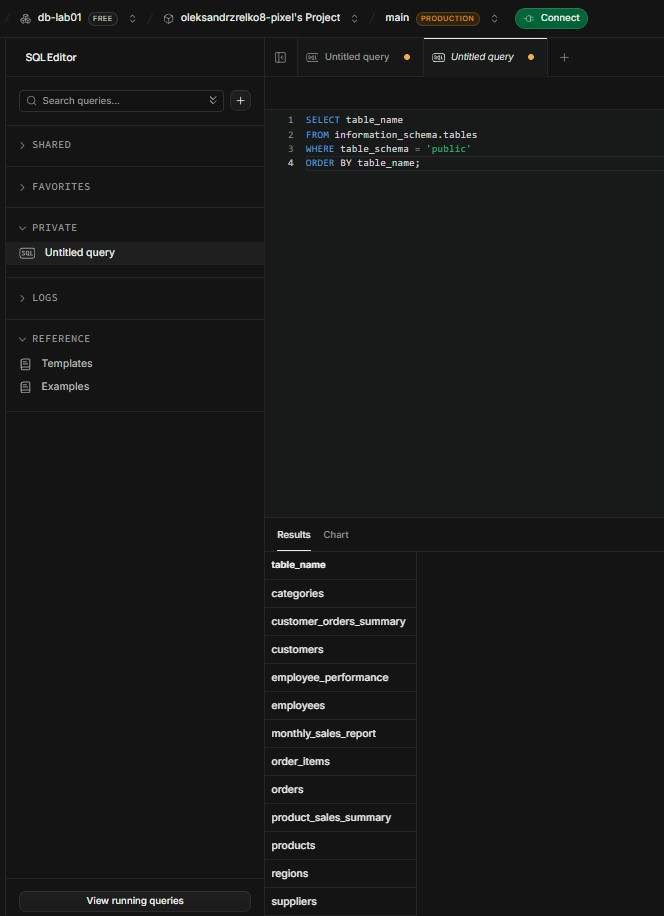

---

## Рівень 1

### 1. Основні SELECT запити

#### 1.1. Отримати всі записи з таблиці customers
```sql
SELECT * FROM customers;
```
**Результат:** Отримано всі 15 записів клієнтів магазину з їхніми контактними даними та типом контрагента.

_Скріншот:_
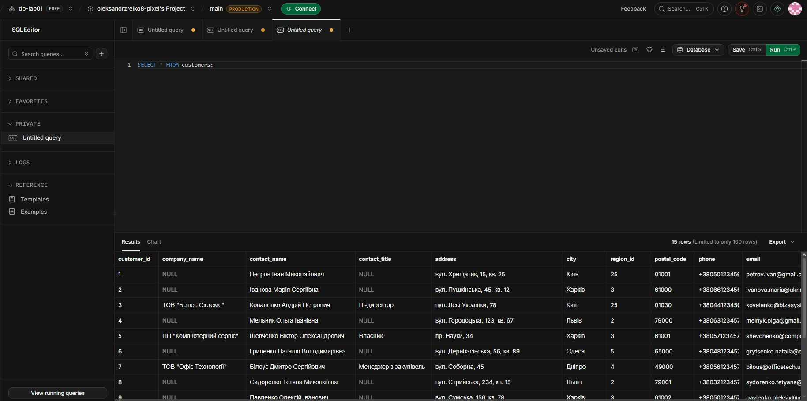

#### 1.2. Вивести тільки назви товарів і їхні ціни з таблиці products
```sql
SELECT product_name, unit_price FROM products;
```
**Результат:** Сформовано прайс-лист асортименту техніки (тільки назва та ціна за одиницю).

_Скріншот:_
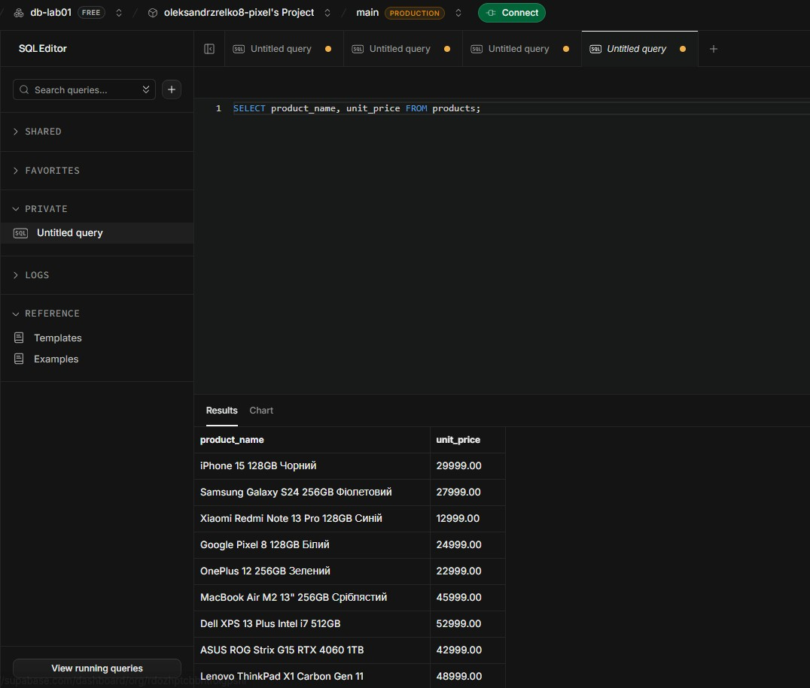

#### 1.3. Показати контактні дані всіх співробітників (ім'я, прізвище, телефон, email)
```sql
SELECT first_name, last_name, phone, email FROM employees;
```
**Результат:** Отримано контактну інформацію всього персоналу компанії для внутрішнього зв'язку.

_Скріншот:_
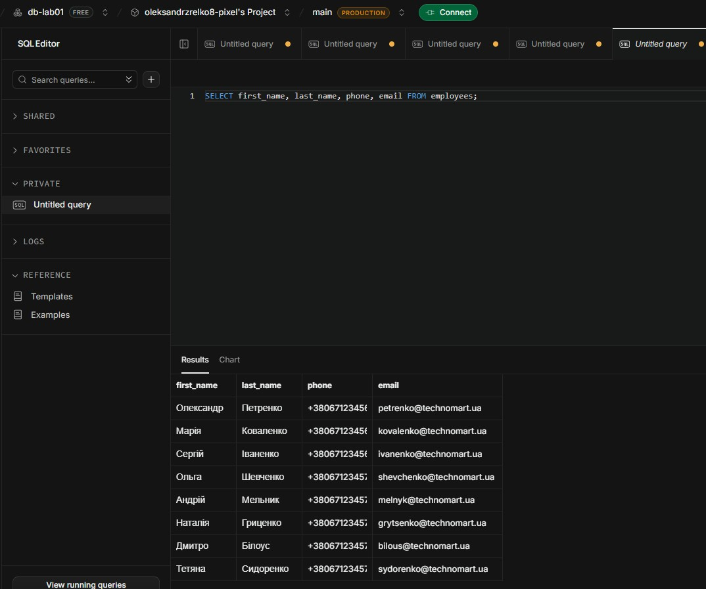

---

### 2. Прості умови WHERE

#### 2.1. Знайти всіх клієнтів з міста Київ
```sql
SELECT * FROM customers WHERE city = 'Київ';
```
**Результат:** Відібрано клієнтів зі столиці для адресної кур'єрської доставки.

_Скріншот:_
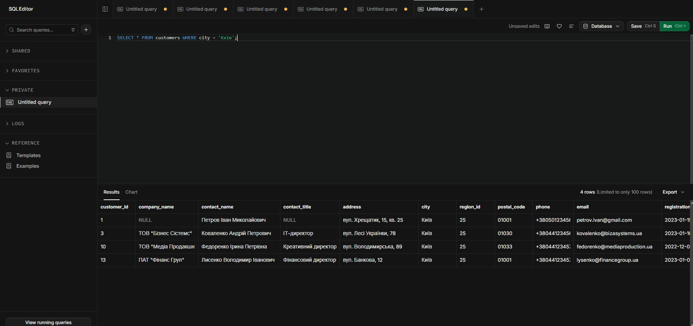

#### 2.2. Вивести товари, які коштують більше 25000 грн
```sql
SELECT product_name, unit_price FROM products WHERE unit_price > 25000;
```
**Результат:** Відображено преміальні моделі ноутбуків, смартфонів та телевізорів дорожче 25 000 грн.

_Скріншот:_
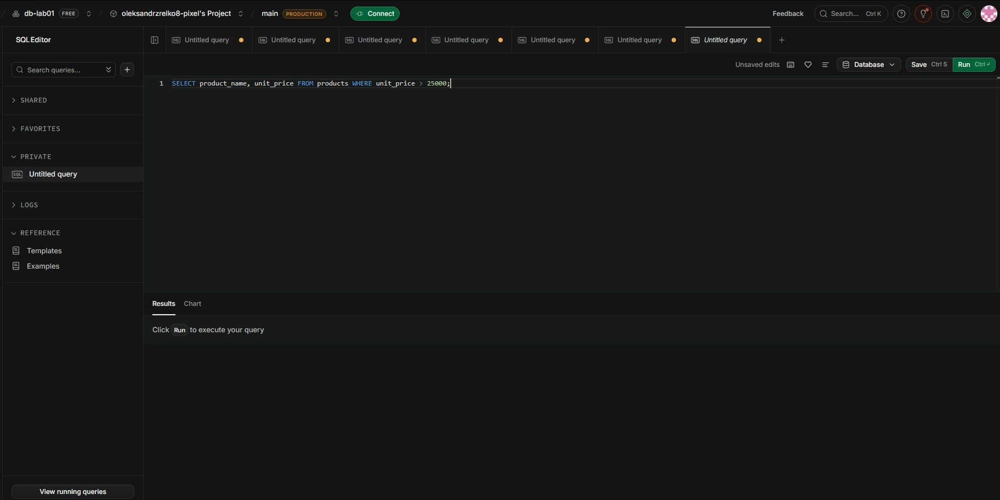

#### 2.3. Показати всі замовлення зі статусом 'delivered'
```sql
SELECT * FROM orders WHERE order_status = 'delivered';
```
**Результат:** Отримано замовлення, які були успішно доставлені покупцям.

_Скріншот:_
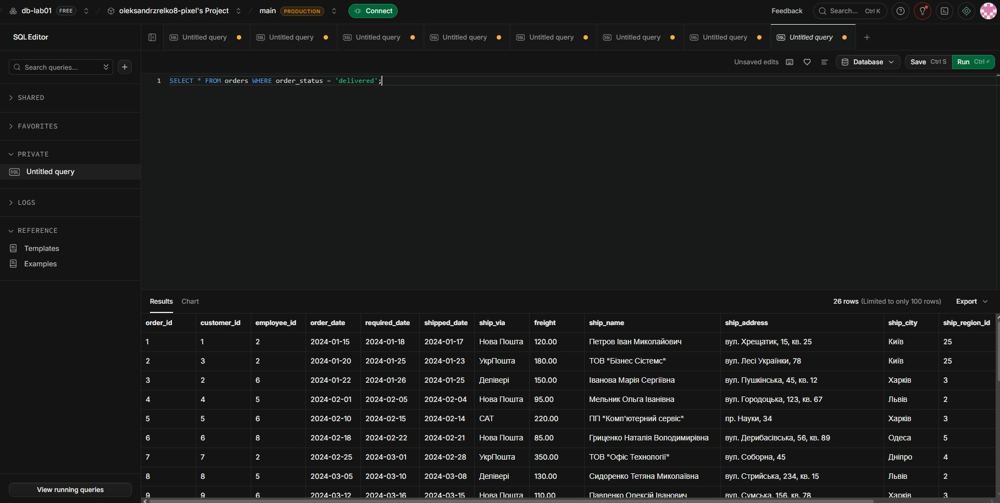

#### 2.4. Знайти співробітників відділу продажів (посада містить "продаж")
```sql
SELECT employee_id, first_name, last_name, title 
FROM employees 
WHERE title ILIKE '%продаж%';
```
**Результат:** Знайдено працівників комерційного відділу на посадах «Менеджер з продажу».

_Скріншот:_
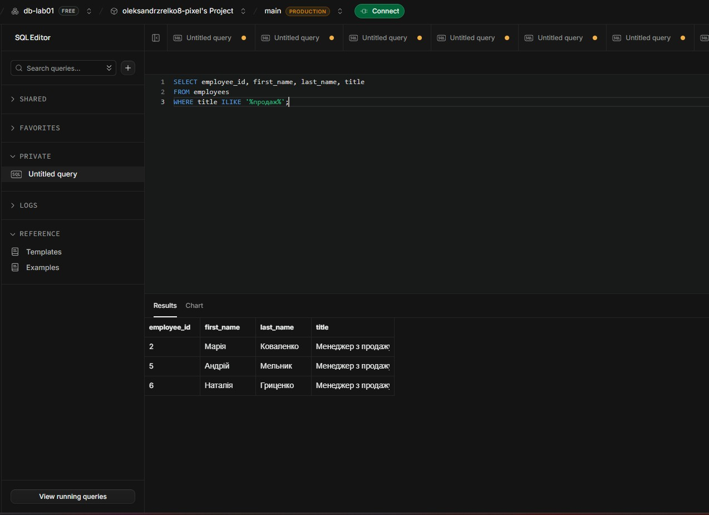

---

### 3. Базове сортування ORDER BY

#### 3.1. Відсортувати товари за зростанням ціни
```sql
SELECT product_name, unit_price FROM products ORDER BY unit_price ASC;
```
**Результат:** Товари виведено в порядку від найдешевшого до найдорожчого.

_Скріншот:_
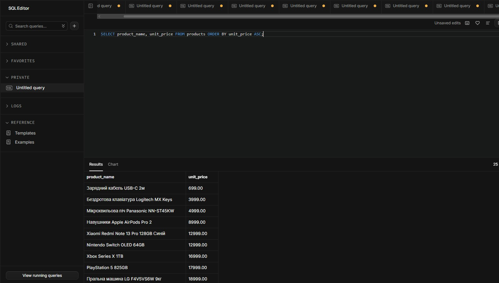

#### 3.2. Показати клієнтів в алфавітному порядку за іменем контактної особи
```sql
SELECT contact_name, city, phone FROM customers ORDER BY contact_name ASC;
```
**Результат:** Сформовано алфавітний реєстр клієнтів від А до Я.

_Скріншот:_
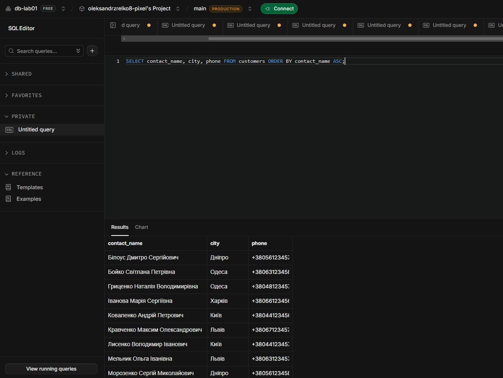

#### 3.3. Вивести замовлення від найновіших до найстаріших
```sql
SELECT order_id, order_date, customer_id, order_status 
FROM orders 
ORDER BY order_date DESC;
```
**Результат:** Журнал замовлень упорядковано від останніх за часом створення до найбільш ранніх.

_Скріншот:_
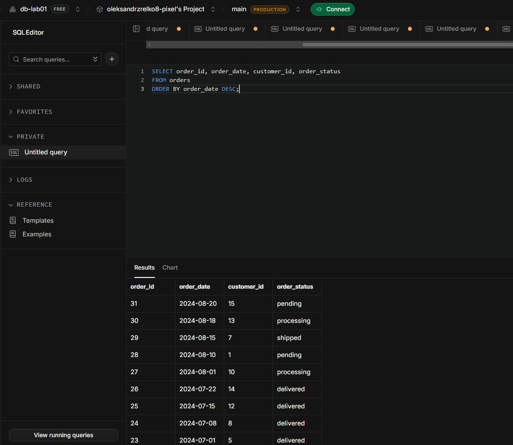

---

### 4. Обмеження результатів LIMIT

#### 4.1. Показати перші 10 найдорожчих товарів
```sql
SELECT product_name, unit_price 
FROM products 
ORDER BY unit_price DESC 
LIMIT 10;
```
**Результат:** Виведено десятку найдорожчих пристроїв асортименту.

_Скріншот:_
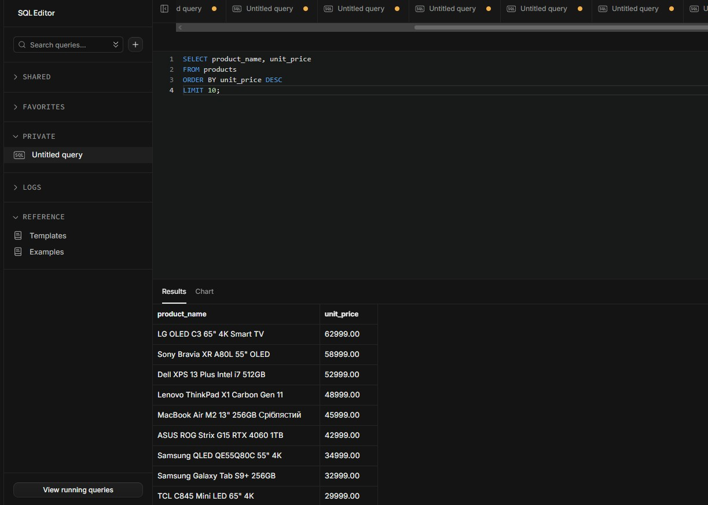

#### 4.2. Вивести 5 останніх замовлень (за датою)
```sql
SELECT order_id, order_date, order_status 
FROM orders 
ORDER BY order_date DESC 
LIMIT 5;
```
**Результат:** Відображено 5 останніх оформлених замовлень у системі.

_Скріншот:_
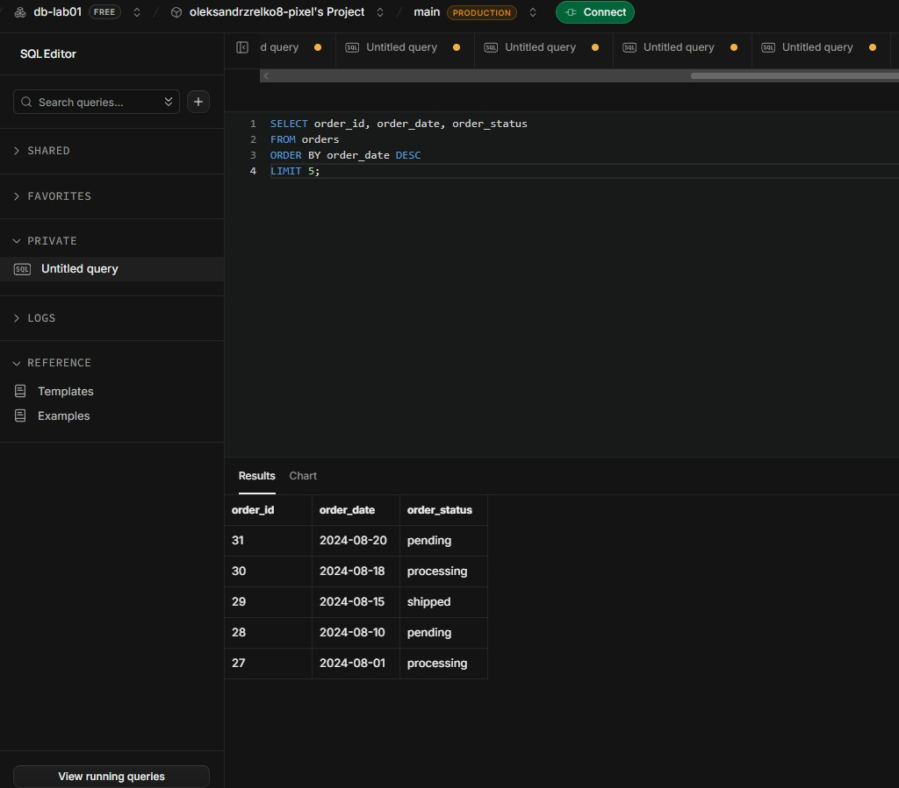

#### 4.3. Отримати перших 8 клієнтів в алфавітному порядку
```sql
SELECT contact_name, city, phone 
FROM customers 
ORDER BY contact_name ASC 
LIMIT 8;
```
**Результат:** Отримано перші 8 клієнтів за абеткою.

_Скріншот:_
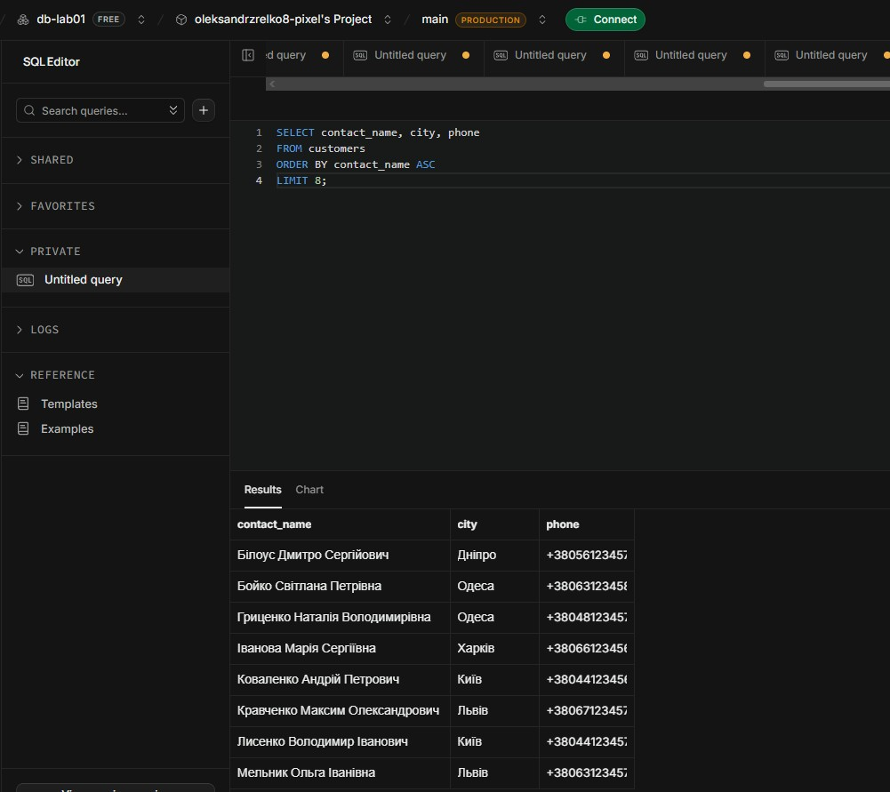

---

## Рівень 2

### 1. Пошук за зразком з LIKE

#### 1.1. Знайти клієнтів, чиї імена починаються на "Іван"
```sql
SELECT customer_id, contact_name, city 
FROM customers 
WHERE contact_name LIKE 'Іван%';
```
**Результат:** Відібрано клієнтів з іменами або прізвищами на «Іван».

_Скріншот:_
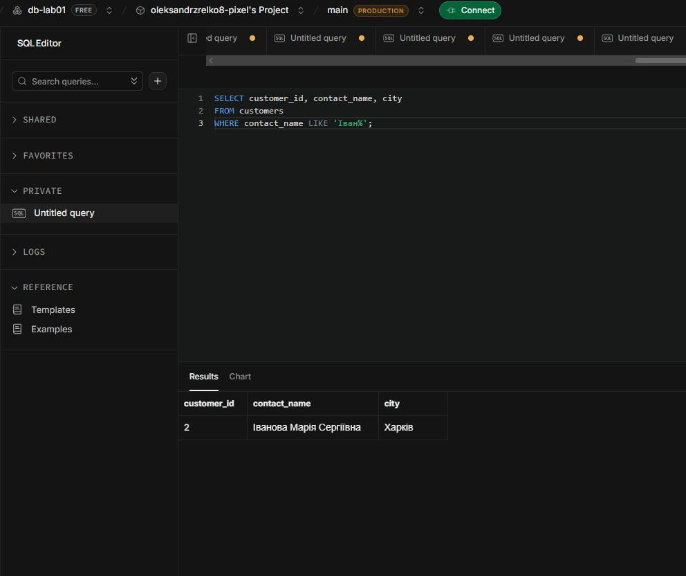

#### 1.2. Вивести товари, в назві яких є слово "phone" або "телефон"
```sql
SELECT product_id, product_name, unit_price 
FROM products 
WHERE product_name ILIKE '%phone%' 
   OR product_name ILIKE '%телефон%';
```
**Результат:** Знайдено всі смартфони та мобільні телефони в базі.

_Скріншот:_
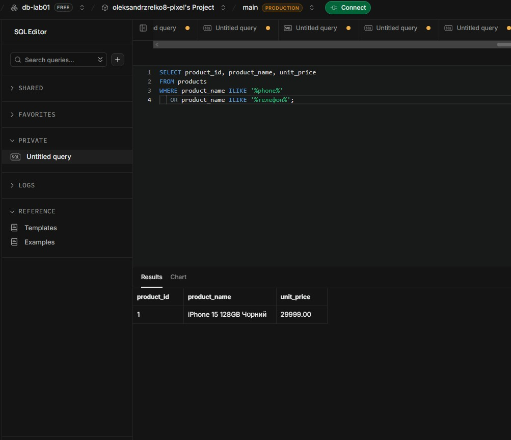

#### 1.3. Самостійно: 3 власні запити з LIKE
```sql
-- 1) Початок: Товари бренду Apple
SELECT product_name, unit_price FROM products WHERE product_name ILIKE 'Apple%';

-- 2) Кінець: Клієнти з поштою Gmail
SELECT contact_name, email FROM customers WHERE email LIKE '%@gmail.com';

-- 3) Містить: Товари серії Pro
SELECT product_name, unit_price FROM products WHERE product_name ILIKE '%Pro%';
```
**Результат:** Продемонстровано роботу шаблонів початку, кінця та входження рядка.

_Скріншот:_
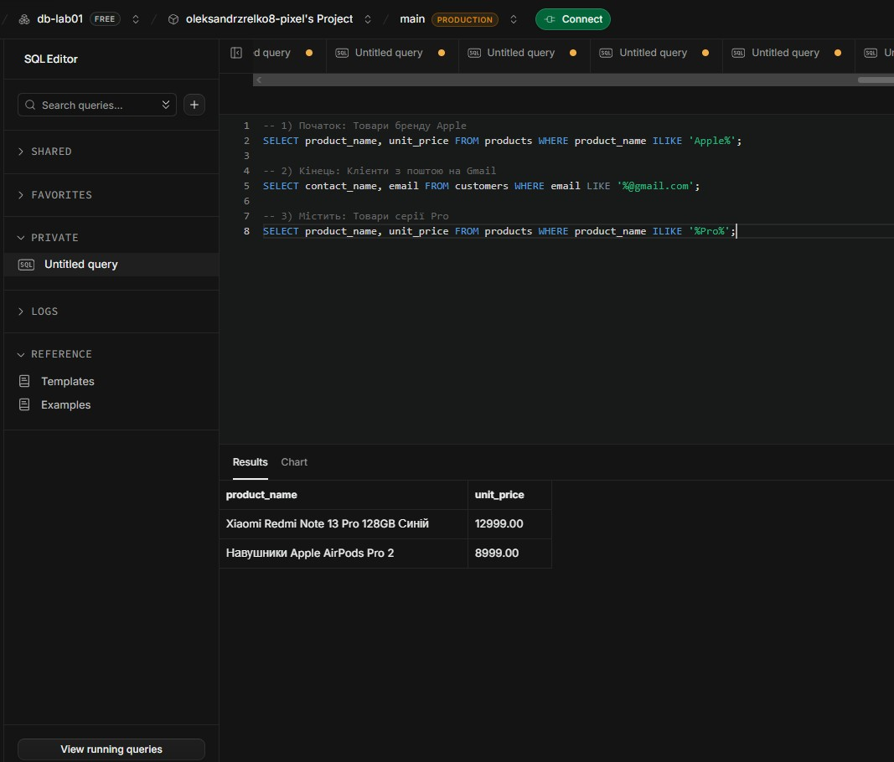

---

### 2. Логічні оператори AND, OR, NOT

#### 2.1. Знайти товари дорожчі за 15000 грн і дешевші за 50000 грн
```sql
SELECT product_name, unit_price 
FROM products 
WHERE unit_price > 15000 
  AND unit_price < 50000;
```
**Результат:** Вибірка середнього та середньо-високого цінового сегмента техніки.

_Скріншот:_
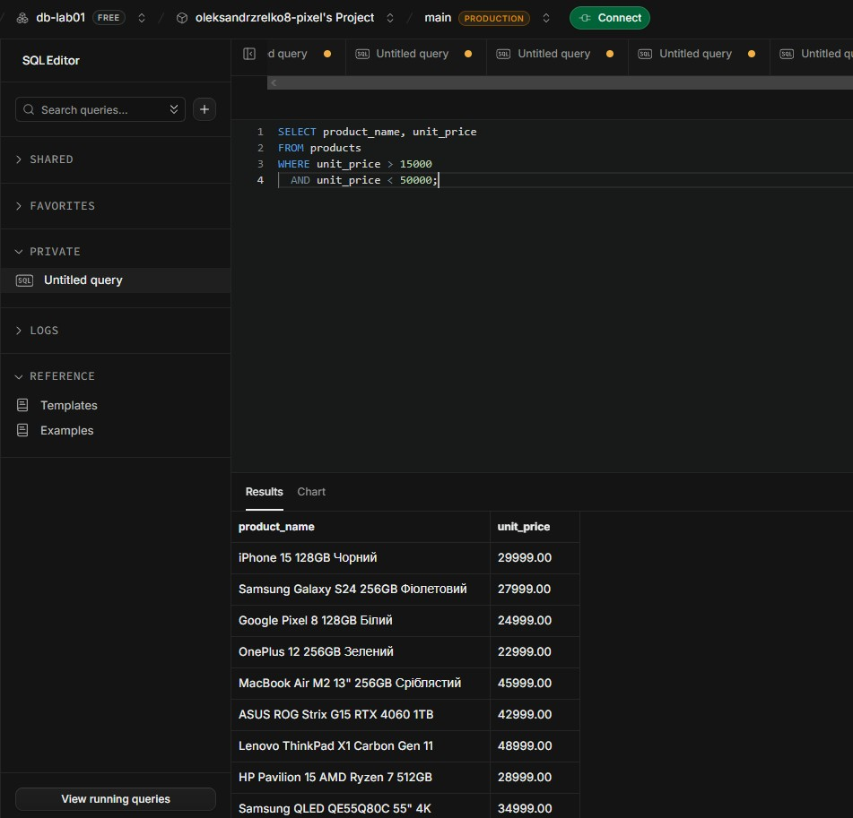

#### 2.2. Вивести клієнтів з Києва або Львова, які є юридичними особами
```sql
SELECT contact_name, company_name, city, customer_type 
FROM customers 
WHERE (city = 'Київ' OR city = 'Львів') 
  AND customer_type = 'company';
```
**Результат:** B2B-контрагенти у двох головних ділових центрах України.

_Скріншот:_
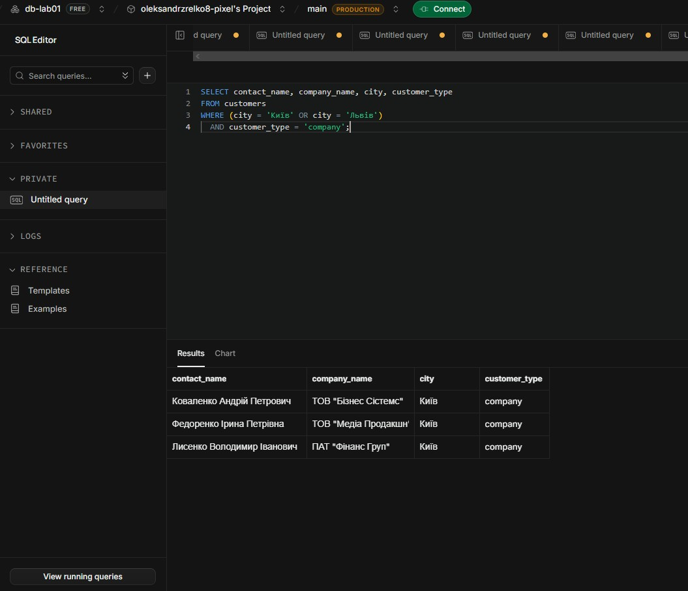

#### 2.3. Самостійно: 4 власні запити з комбінаціями AND, OR, NOT
```sql
-- 1) Актуальні недорогі товари в наявності (таблиця products)
SELECT product_name, unit_price, units_in_stock FROM products 
WHERE unit_price < 15000 AND units_in_stock > 0 AND NOT discontinued;

-- 2) Активні замовлення без залучення співробітника №1 (таблиця orders)
SELECT order_id, order_status, employee_id FROM orders 
WHERE (order_status = 'shipped' OR order_status = 'processing') AND NOT employee_id = 1;

-- 3) Фізичні особи не з Києва з номером телефону (таблиця customers)
SELECT contact_name, city, phone FROM customers 
WHERE customer_type = 'individual' AND NOT city = 'Київ' AND phone IS NOT NULL;

-- 4) Працівники не з відділу продажів з корпоративною поштою (таблиця employees)
SELECT first_name, last_name, title, email FROM employees 
WHERE NOT title ILIKE '%продаж%' AND email IS NOT NULL;
```
**Результат:** Сформовано 4 цільові вибірки для різних відділів магазину.

_Скріншот:_
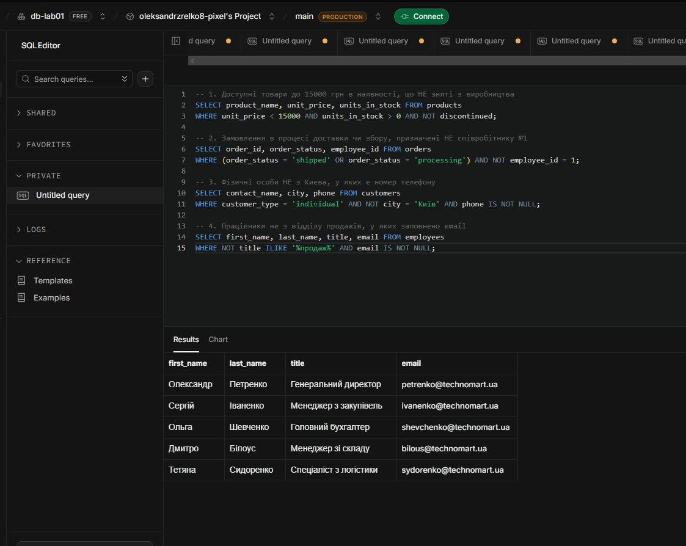

---

### 3. Оператори IN, BETWEEN, IS NULL

#### 3.1. Вивести клієнтів з міст Київ, Харків, Одеса, Дніпро
```sql
SELECT contact_name, city, phone 
FROM customers 
WHERE city IN ('Київ', 'Харків', 'Одеса', 'Дніпро');
```
**Результат:** Клієнти з найбільших міст-мільйонників України.

_Скріншот:_
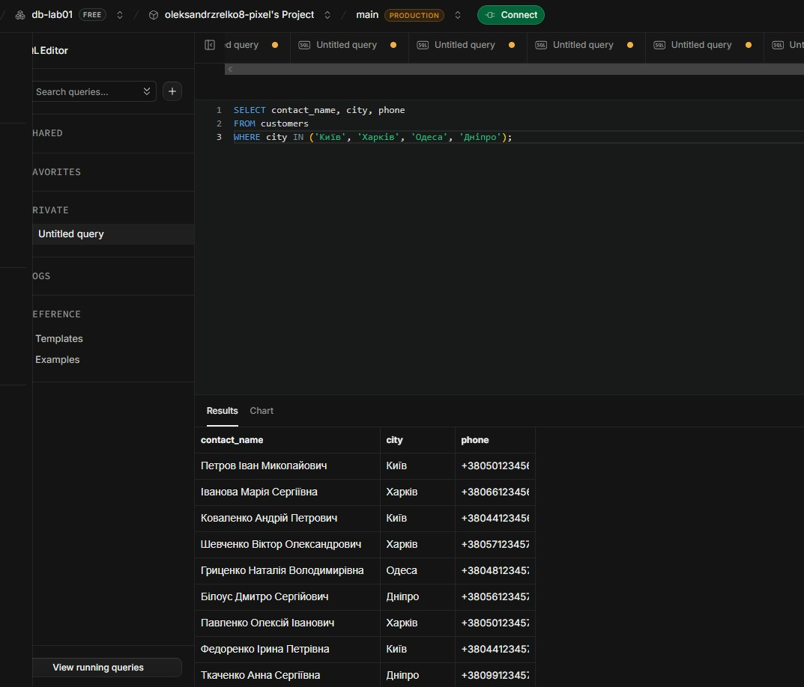

#### 3.2. Знайти товари в ціновому діапазоні від 10000 до 30000 грн
```sql
SELECT product_name, unit_price 
FROM products 
WHERE unit_price BETWEEN 10000 AND 30000;
```
**Результат:** Перелік товарів популярного споживчого діапазону цін.

_Скріншот:_
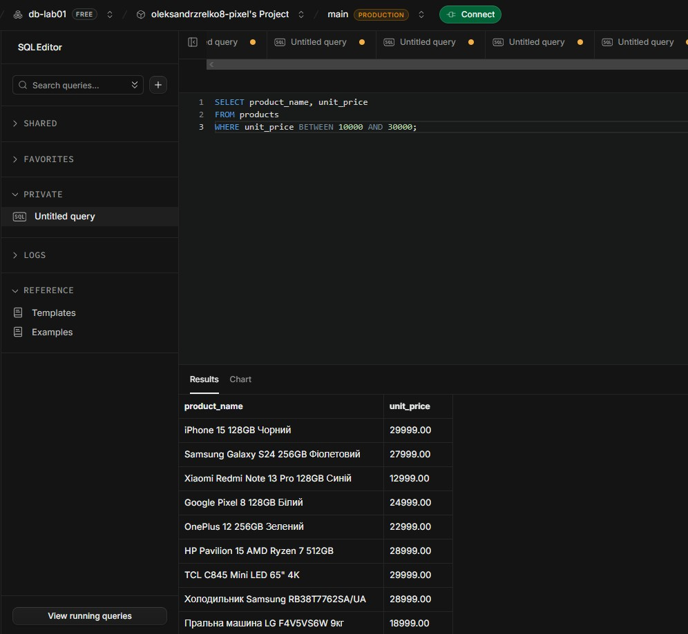

#### 3.3. Самостійно: по 2 запити для IN, BETWEEN, IS NULL / IS NOT NULL
```sql
-- IN:
SELECT order_id, order_date, order_status FROM orders WHERE order_status IN ('pending', 'processing');
SELECT product_name, category_id, unit_price FROM products WHERE category_id IN (1, 2, 7);

-- BETWEEN:
SELECT product_name, units_in_stock FROM products WHERE units_in_stock BETWEEN 10 AND 30;
SELECT order_id, order_date, order_status FROM orders WHERE order_date BETWEEN '2024-01-01' AND '2024-03-31';

-- IS NULL / IS NOT NULL:
SELECT order_id, order_date, order_status FROM orders WHERE shipped_date IS NULL;
SELECT product_name, description FROM products WHERE description IS NOT NULL;
```
**Результат:** Повністю охоплено перевірку списків значень, діапазонів та наявності даних.

_Скріншот:_
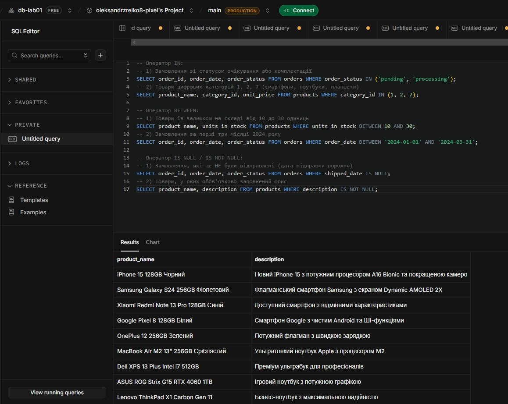

---

### 4. Комбінування умов

#### 4.1. Самостійно: 5 складних запитів із поєднанням умов
```sql
-- 1. LIKE + AND: Дорогі товари Samsung у наявності
SELECT product_name, unit_price, units_in_stock FROM products 
WHERE product_name ILIKE '%Samsung%' AND unit_price > 20000 AND units_in_stock > 0;

-- 2. BETWEEN + IN: Товари від 5000 до 25000 грн із категорій 1 та 4
SELECT product_name, category_id, unit_price FROM products 
WHERE (unit_price BETWEEN 5000 AND 25000) AND category_id IN (1, 4);

-- 3. LIKE + OR + NOT: Клієнти на -ко чи -ук не з Києва
SELECT contact_name, city, phone FROM customers 
WHERE (contact_name LIKE '%ко' OR contact_name LIKE '%ук') AND NOT city = 'Київ';

-- 4. BETWEEN + IS NULL: Замовлення за серпень 2024 року без дати відправки
SELECT order_id, order_date, order_status FROM orders 
WHERE (order_date BETWEEN '2024-08-01' AND '2024-08-31') AND shipped_date IS NULL;

-- 5. IN + LIKE + IS NOT NULL: Юрособи Києва та Дніпра з телефонами
SELECT contact_name, company_name, city, phone FROM customers 
WHERE city IN ('Київ', 'Дніпро') AND (phone LIKE '+38067%' OR phone LIKE '+38044%') AND company_name IS NOT NULL;
```
**Результат:** 5 аналітичних зрізів даних із поєднанням різних логічних конструкцій.

_Скріншот:_
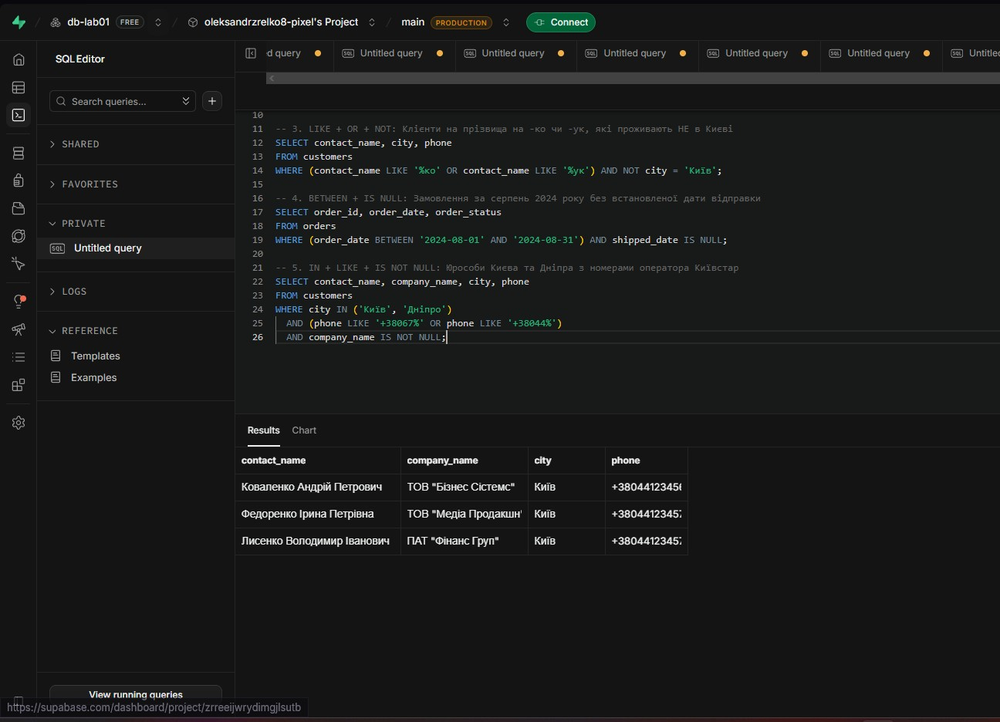

---

### 5. Складне сортування та пагінація

#### 5.1. Самостійно: 3 запити сортування за кількома полями
```sql
-- 1. Товари: за категорією (ASC) та спаданням ціни (DESC)
SELECT category_id, product_name, unit_price FROM products ORDER BY category_id ASC, unit_price DESC;

-- 2. Клієнти: за містом (ASC) та типом контрагента (DESC)
SELECT city, customer_type, contact_name FROM customers ORDER BY city ASC, customer_type DESC;

-- 3. Замовлення: за статусом (ASC) та датою (DESC)
SELECT order_status, order_date, order_id FROM orders ORDER BY order_status ASC, order_date DESC;
```
**Результат:** Багаторівневе сортування за двома ключами одночасно.

_Скріншот:_
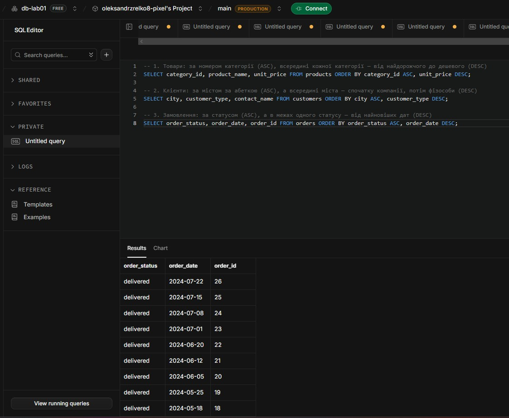

#### 5.2. Самостійно: 2 запити з OFFSET для пагінації
```sql
-- 1. Друга сторінка каталогу товарів (10 на сторінку)
SELECT product_id, product_name, unit_price FROM products ORDER BY product_id ASC LIMIT 10 OFFSET 10;

-- 2. Друга сторінка клієнтів (5 на сторінку)
SELECT customer_id, contact_name, city FROM customers ORDER BY customer_id ASC LIMIT 5 OFFSET 5;
```
**Результат:** Продемонстровано механізм посторінкової вибірки за допомогою `LIMIT` та `OFFSET`.

_Скріншот:_
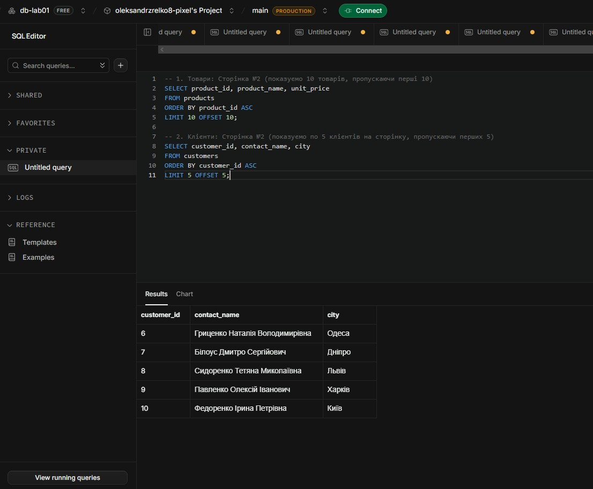

---

## Висновки

Під час виконання лабораторної роботи було освоєно базові та розширені інструменти написання SQL-запитів мови вибірки даних (DQL) у хмарній СУБД PostgreSQL на платформі Supabase:
1. Засвоєно структуру команди `SELECT`, проекцію стовпців, базову фільтрацію рядків за допомогою `WHERE`, сортування результатів за допомогою `ORDER BY` та обмеження кількості записів `LIMIT`.
2. Опановано текстовий пошук за шаблонами з оператором `LIKE`/`ILIKE` із використанням спецсимволів `%`.
3. Вивчено застосування логічних операторів `AND`, `OR`, `NOT`, оператора перевірки входження до множини `IN`, перевірки діапазонів `BETWEEN`, а також коректну роботу зі спеціальними значеннями `IS NULL` та `IS NOT NULL`.
4. Реалізовано багаторівневе сортування за кількома полями та пагінацію результатів через комбінацію `LIMIT` та `OFFSET`.

- **Самооцінка:** 4 (добре)
- **Обґрунтування:** У повному обсязі виконано всі завдання Рівня 1 та Рівня 2. Усі обов'язкові та самостійні запити протестовані в базі даних `technomart`, супроводжуються коментарями, описом бізнес-логіки та скріншотами результатів.

